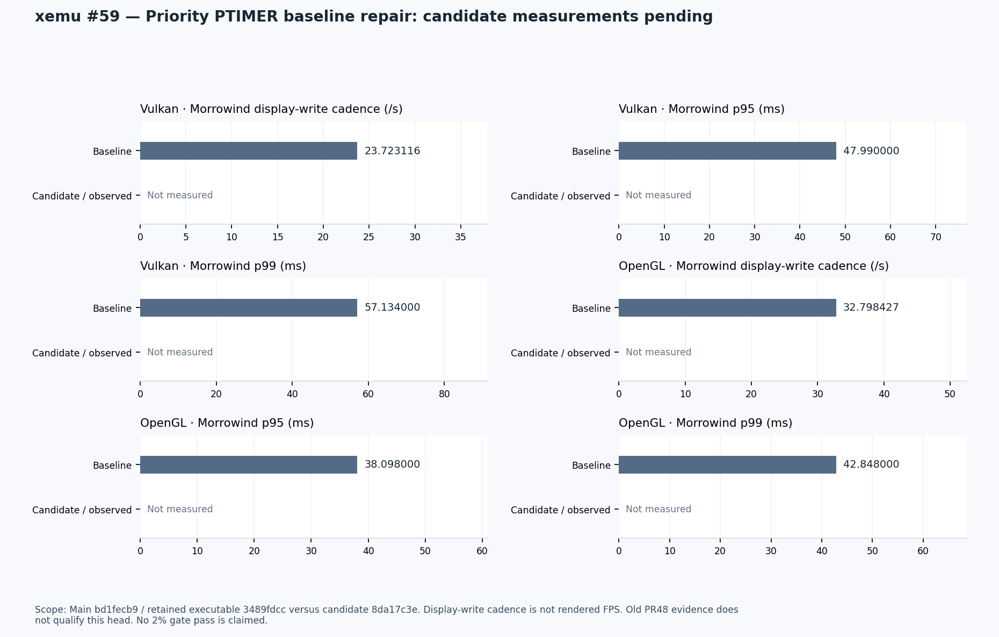

# Current-main PTIMER baseline correction

[PR #59](https://github.com/Mainkill1/xemu/pull/59) prioritizes [masked-alarm issue #40](https://github.com/Mainkill1/xemu/issues/40), with the separately tracked [deadline issue #39](https://github.com/Mainkill1/xemu/issues/39). Main remains unchanged. Other optimization tests are paused pending this baseline decision.

| Evidence | Status |
| --- | --- |
| Current-main source inspection | Both defects remain in `bd1fecb9` |
| Candidate extraction | `8da17c3e`, tree `20c4d0a4`; focused timer/state/test changes |
| Independent source review | No concrete production blocker found; pre-expiry mask/unmask control added |
| Production Xbox timer suite | 24 controls registered; execution pending |
| Shared generic timer suite | Required because support stubs are shared; execution pending |
| Exact current-main negative controls | Pending; old S-based reports do not qualify this baseline |
| Native VMState and guest checks | Pending |
| Fixed-work performance and resources | Pending; no 2% gate pass claimed |

The chart shows retained main Morrowind display-write cadence and interval tails, not rendered FPS. It contains no measured candidate values. Raw numeric inputs are in [metrics.json](metrics.json), identities and artifact hashes in [manifest.json](manifest.json). Renderer: [shared chart script](../../pr-metrics-20260909/render_pr_charts.py), matplotlib 3.10.6.

The existing baseline executable is reused. Matching measurements may need collection where none exist; the baseline emulator will not be rebuilt for this experiment. Main can be updated only after the known defects are fixed and applicable correctness/performance gates pass. A measured regression above 2% rejects the candidate; missing or inconclusive evidence does not approve it.

Historical [PR #48](https://github.com/Mainkill1/xemu/pull/48) controls and snapshot observations guide the test plan but are not exact-head qualification. Tests use the existing production translation-unit target, including PRAMDAC, and distinguish helper-state controls from actual VMState streams.
